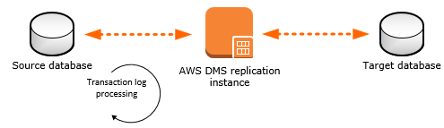
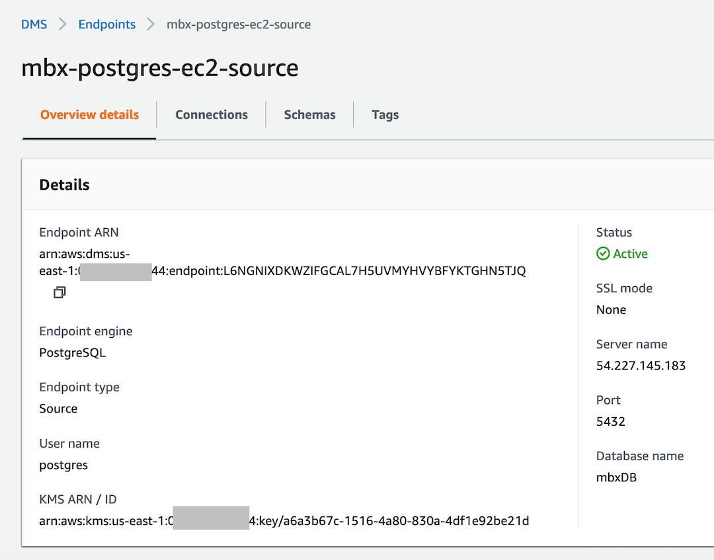
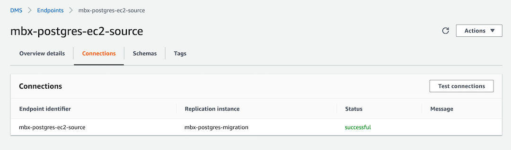
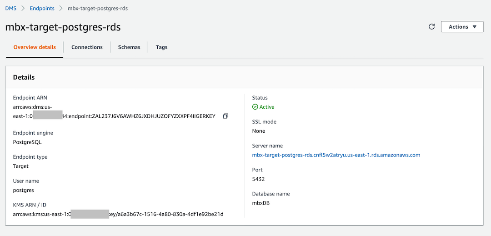
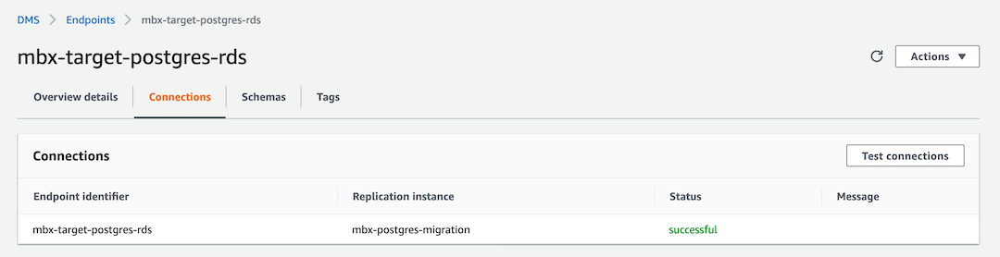
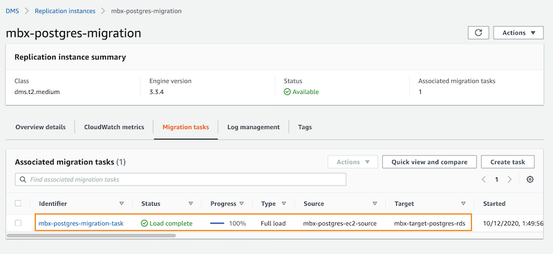
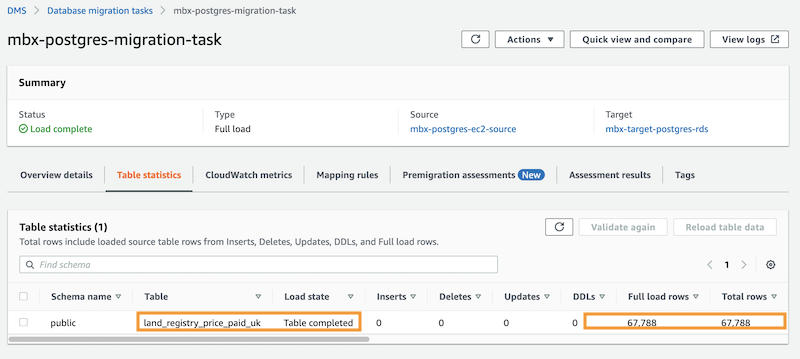

# aws-dms-postgres-onprem-to-rds

***DRAFT***

***Overview of Guide***

In this guide, I will deploy an AWS Database Migration Service (DMS) pipeline to migrate an EC2-hosted Postgres source database (or on-prem) to an RDS Postgres target database. I will be working with a Postgres 12 DB so the commands and settings in this guide will reflect the version number. Please ensure that the commands are updated to reflect your version of Postgres. 



This guide assumes a non-production Postgres workload and data running in a non-production AWS environment. If you are working in a production environment, please follow best practices for cloud security and compliance. To simplify the guide and keep it to a managable length, workloads are provisioned with public endpoints, no encryption unless enabled by default, and basic authintication. When possible, I have left the default values unchanged during the creation of cloud resources.    

When the migration is complete, a table hosted on the on-premise (EC2) Postgres database will be migrated to an Amazon RDS Postgres database.

***Database Migration Guide Outline***

This guide is made up of the following sections:

* Deploy an EC2-hosted Postgres DB
* Deploy an RDS Postgres DB
* Install pgAdmin, a popular GUI client for Postgres DB
* Import test data into the EC2 Postgres DB
* Deploy the Database Migration Service (DMS)
  * Create the DMS Replication Instance
  * Create and Test The DMS Source EC2 Endpoint
  * Create and Test The DMS Target RDS Endpoint
  * Create a DMS Migration Task
  * Run the DMS Migration Task
  * Verify table data migration from source DB to target DB. 
  

***Deploy an EC2-hosted Postgres DB***

* Login to the AWS Management Console 
* Set your AWS Region
* From the EC2 dashboard: 
* Launch a new EC2 instance using the Amazon-managed Ubuntu 20.x AMI
* Select EC2 Instance Type m5a.large
* Select the default VPC
* Select desired subnet/AZ
* Enable Assign Public IP. Later, attach an Elastic IP so you don't end up with a different public IP address every time you restart your EC2 instance. 
* Optional: Attach IAM SSM Role (to allow remote access into EC2 without the need for SSH)
* For storage, assign 20 GB for good measures. This is more than enough for the test dataset
* Assign a tag to the EC2 instance
* Select Security Group with inbound rule for the Postgres port. Typically, the port is 5432. If you will be using SSH, also open port 22 
* Review your configuration and Launch the EC2 instance
* Wait for EC2 instance until you see "Running" with a status check of 2/2
* Attach an Elastic Public IP Address. Note the public IP address of your EC2 instance. You will use this IP when you configure your server access as well as the DMS endpoints. 
* Connect to the EC2 instance using your favorite method. I prefer to use the AWS SSM Remote Session. 

Now that my EC2 instance is up and running and I am at the command prompt, I will install and configure Postgres 12. PostgreSQL configuration files are stored in the /etc/postgresql/<version>/main directory. For example, if you plan to install PostgreSQL 12, the configuration files are stored in the /etc/postgresql/12/main directory.

* From the command prompt, enter the following commands:
```bash
sudo sh -c 'echo "deb http://apt.postgresql.org/pub/repos/apt $(lsb_release -cs)-pgdg main" > /etc/apt/sources.list.d/pgdg.list'
wget --quiet -O - https://www.postgresql.org/media/keys/ACCC4CF8.asc | sudo apt-key add -
sudo apt-get update
sudo apt-get -y install postgresql-12
```
* To allow remote connection to my PostgreSQL DB, I will modify the postgresql.conf file. Please update the command path to reflect your Postgres version number:
```bash
sudo vim /etc/postgresql/12/main/postgresql.conf
```

* Locate the line #listen_addresses = ‘localhost’ and change/uncomment to:
```bash
listen_addresses = '*'
```
* Save & exit the file. 
* Enable TCP/IP connections and use the MD5 method for client authentication for postgres user. Update the file file pg_hba.conf:

```bash
sudo vim /etc/postgresql/12/main/pg_hba.conf
```
* Add the following lines then save & exit the file. 
```bash
local   all    postgres       md5
host    all    all            0.0.0.0/0                       md5
host    all    all            ::/0                            md5
```
* To set a password for the default postgres user. Run the following command at a terminal prompt to connect to the default PostgreSQL template database:
```bash
sudo -u postgres psql template1
```
* From the SQL prompt, enter the command:
```bash
ALTER USER postgres with encrypted password 'your_password';
```
* Quit the SQL prompt with the command: 
```bash
\q
```
* Restart Postgres for the changes to take effect:
```bash
sudo systemctl restart postgresql.service
```
Now it's time to provision the target RDS database that we wish to migrate to. 

***Provision The Target RDS Postgres 12 Database***

Follow the RDS database creation wizard. I have chosen the settings for convenience and to keep the guide short. In your AWS environment, your settings may vary according to your security, performance, and cost optimization requirements.  

* Login to AWS Management Console and proceeds to the RDS Dashboard.
* Select Postgres
* Select Template: Dev/Test
* Assign a DB instance identifier/name
* Set Master username: postgres
* Assign a Master password
* Set DB instance size: Select standard class / db.m5.large
* Set Storage: 40GB
* Storage autoscaling: disable/uncheck
* Multi-AZ deployment: Check Do not create a standby instance. 
* Connectivity: Select the VPC. The default VPC will work. 
* Subnet group: Select from available. 
* Public access: Yes
* VPC security group: select the default security group as well as a security group with inbound rule that opens up the database port (in this case port 5432)
* Availability Zone: AZ1
* Database port: 5432
* Database authentication: Password authentication
* Database options: Assign an initial database name
* DB parameter group: select the default or your customized option group
* For the remaining options, I have unchecked them but feel free to enable the options that you need for your testing purposes. 
* Select Create and wait for the status to show the DB is Available.
* Click the View credentials details button on the upper right to copy your DB credentials.   

***Deploy pgAdmin For Postgres Administration***

pgAdmin is a popular GUI client for Postgres. You can perform various admin and development tasks with the help of this user friendly tool. I will use it to verify connectivity to both source and target databases as well as import test data and verify migration of data from source to target DB. If you prefer command line tool, the psql utility is your goto tool. 

For this section, we will need the following data ready:

* Public IP of the EC2 instance hosting the source Postgres DB 
* The endpoint for the target Postgres RDS DB
* Access credentials for both DBs 
* Ensure security groups attached to both DBs have inbound rules to allow incoming traffic thru port 5432. 

Let's proceed to install pgAdmin. 

* Download pgAdmin for your OS: https://www.pgadmin.org/
* Install pgAdmin according to the instructions.
* Create a New Server connection record for the source Postgres running on the EC2 instance, and verify connectivity.
* Create a New Server connection record for the target Postgres in RDS, and verify connectivity.


***Load Test Data Into The Source Postgres DB***

You can find detailed info about the sample data on this wiki page: https://wiki.postgresql.org/wiki/Sample_Databases. 

In this guide, I have downloaded the monthly csv file instead of the full dataset. https://www.gov.uk/government/statistical-data-sets/price-paid-data-downloads#current-month-august-2020-data. First, lets create the project database. 

* From the EC2 Postgres server, log into the psql command line utility
```bash
sudo -u postgres psql template1
```
* From the psql command line, list key database resource
```bash
\l
```
* Create the test database to be migrated. I am assigning the name mbxDB to my database but you can assign a different name. 
```bash
create database mbxDB;
```
* Make mbxDB active
```bash
\c mbxDB
```
* Create table structure for table land_registry_price_paid_uk
```bash
CREATE TABLE land_registry_price_paid_uk(
  transaction uuid,
  price numeric,
  transfer_date date,
  postcode text,
  property_type char(1),
  newly_built boolean,
  duration char(1),
  paon text,
  saon text,
  street text,
  locality text,
  city text,
  district text,
  county text,
  ppd_category_type char(1),
  record_status char(1));
```
* Quit psql
```bash
\q
```
* You will now return to the OS command line.

***Import land_registry_price_paid_uk CSV Data***

* I will use pgAdmin for the data import task because of the simplicity of the workflow, the psql command line tool can do the trick too. 
* Find the mbxDB and expand it
* Find and select the land_registry_price_paid_uk table 
* Right click on the table land_registry_price_paid_uk
* Select Import/Export from the menu
* In the dialog box, select Import from the Export/Import slider
* Import the file from your local drive or from where you downloaded the csv file to. 
* Select the CVS file and wait for successful import
* Verify data is uploaded using pgAdmin by viewing data rows from the land_registry_price_paid_uk table

***Provision The Database Migration Service***

In this section, I will configure the DMS resources that will kick-off the database migration. The steps involved are as follows:

* Create a Replication Instance
* Create and test the source DB endpoint
* Create and test the target DB endpoint
* Create the Migration Task
* Validate/iterate until all required data is migrated from the EC2 hosted Postgres to the RDS Postgres.

**Create Replication Instance**

* From the AWS Management Console, open the Database Migration Service dashboard.
* From the left panel, select Replication instances
* Click on Create application instance
* Fill out the wizard forms
* Assign a name to the replication instance. 
* Instance class: dms.t2.medium
* Engine version: 3.3.4
* Storage Allocation: 50 GB (default)
* VPC: Default
* Multi-AZ: uncheck/deselect
* Publicly accessible: check/select
* Advanced security and network configuration: accept defaults
* Maintenance: accept defaults
* Click on Create
* Wait for Status to change to Available

**Create And Test The Source EC2 DB Endpoint**

* From the Database Migration Service dashboard
* From the left panel, select Endpoints
* Select Source endpoint
* Fill out the wizard forms
* Assign a name to the Endpoint identifier. Ex: mbx-postgres-ec2-source
* From the Source engine dropdown menu, select postgres
* For Server name, provide the public IP address for the EC2 Postgres instance. 
* Port: 5432
* User name: postgres
* Password: enter the password that you have specified earlier
* Database name: mbxDB
* Expand the Test endpoint connection 
* Select the default VPC
* Select the replication instance name you have created
* Select Run test
* Wait for the test status to show successful
* If not, troubleshoot cause before you proceed to next step







**Create And Test The Target DB RDS Endpoint**

* From the Database Migration Service dashboard
* From the left panel, select Endpoints
* Select Target endpoint 
* Assign a name to the Endpoint identifier. Ex: mbx-target-postgres-rds
* Check Select RDS DB instance
* From the dropdown menu, select the RDS Postgres DB you have created earlier
* The remaining fields will be filled out automatically based on your RDS database selection except the password which you will need to provide
* Expand the Test endpoint connection 
* Select the default VPC
* Select the replication instance name you have created
* Select Run test
* Wait for the test status to show successful
* If not, troubleshoot cause before you proceed to next step





Once you you have successful endpoint tests, proceed to create the migration task

**Create The Database Migration Task**
* From the Database Migration Service dashboard
* Select Database migration tasks
* Select Create task
* Enter a name for Task identifier. Ex: mbx-postgres-migration-task
* From the Replication instance dropdown menu, select the replication instance you have created earlier
* From the Source database endpoint, select the source EC2 endpoint
* From the Target database endpoint, select the target RDS endpoint
* From the Migration typ, select Migrate existing data
* In the Task settings panel > Editing mode, select Wizard
* Select Drop tables on target (default)
* Select Limited LOB mode (default)
* For Maximum LOB size (KB), keep the 32K value. 
* Check Enable CloudWatch logs
* In the Table mappings panel > Editing mode, select Wizard
* Expand Selection rules
* For Schema name, enter %
* For Table name, enter %
* Select Create task
* If the Task did not start, from the Actions dropdown meny, select Restart/Resume
* In the Summary panel, wait for the status to show Load complete

* From the Table statistics panel, scroll to verify that you have 67,788 rows loaded

* Using pgAdmin, verify that the data is migrated to RDS. This video clip will show the final reasults of migrated data in RDS.  

https://youtu.be/QHKhyzPUPaU

Thank you...


