# Migrating an On-premise Postgres 12 Database to an Amazon RDS Postgres 12 database using the AWS Database Migration Service

## Introduction
Database migrations can often be complex and challenging, especially when moving from self-managed environments to fully managed cloud services. This guide demonstrates how to deploy an AWS Database Migration Service (DMS) pipeline to seamlessly migrate a self-hosted PostgreSQL database to an Amazon RDS target database. Whether you are lifting and shifting an on-premises workload or a cloud-hosted baseline database, this tutorial provides a comprehensive walkthrough.

## Technology Stack and Tools
*   **Source Database Environment:** A self-hosted Postgres 12 database running on an Amazon EC2 instance (Ubuntu 20.04), simulating an on-premise or unmanaged database environment.
*   **Target Database Environment:** Amazon Relational Database Service (RDS) running Postgres 12, a fully managed, highly available database engine.
*   **Migration Engine:** AWS Database Migration Service (DMS), a robust tool designed to migrate relational databases, data warehouses, NoSQL databases, and other types of data stores securely and efficiently with minimal downtime.
*   **Client Tool:** pgAdmin, a widely-used graphical user interface (GUI) supporting administration and development for Postgres.

## Overview of Guide
In this guide, I will deploy an AWS Database Migration Service (DMS) pipeline to migrate an EC2-hosted Postgres source database (or on-prem) to an RDS Postgres target database. I will be working with a Postgres 12 DB so the commands and settings in this guide will reflect the version number. Please ensure that the commands are updated to reflect your version of Postgres. 

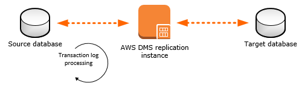

This guide assumes a non-production Postgres workload and data running in a non-production AWS environment. If you are working in a production environment, please follow best practices for cloud security and compliance. To simplify the guide and keep it to a manageable length, workloads are provisioned with public endpoints, no encryption unless enabled by default, and basic authentication. When possible, I have left the default values unchanged during the creation of cloud resources.  

When the migration is complete, a table hosted on the on-premise (EC2) Postgres database will be migrated to an Amazon RDS Postgres database.

This video is an overview of the working DMS pipeline that will be deployed in this guide: https://youtu.be/crQDJD6Dj7U

## Database Migration Guide Outline

This guide is made up of the following sections:

*   Deploy an EC2-hosted Postgres DB
*   Deploy an RDS Postgres DB
*   Install pgAdmin, a popular GUI client for Postgres DB
*   Import test data into the EC2 Postgres DB
*   Deploy the Database Migration Service (DMS)
    *   Create the DMS Replication Instance
    *   Create and Test The DMS Source EC2 Endpoint
    *   Create and Test The DMS Target RDS Endpoint
    *   Create a DMS Migration Task
    *   Run the DMS Migration Task
    *   Verify table data migration from source DB to target DB.

## Deploy an EC2-hosted Postgres DB

1.  Login to the AWS Management Console.
2.  Set your AWS Region.
3.  Navigate to the EC2 dashboard.
4.  Launch a new EC2 instance using the Amazon-managed Ubuntu 20.04 AMI.
5.  Select EC2 Instance Type `m5a.large`.
6.  Select the default VPC.
7.  Select desired subnet and Availability Zone.
8.  Enable Auto-assign Public IP. Later, attach an Elastic IP so you don't end up with a different public IP address every time you restart your EC2 instance. 
9.  *Optional:* Attach an IAM SSM Role (to allow remote access into the EC2 without the need for SSH).
10. For storage, assign 20 GB for good measure. This is more than enough for the test dataset.
11. Assign a tag to the EC2 instance.
12. Select a Security Group with an inbound rule for the Postgres port. Typically, the port is `5432`. If you will be using SSH, also open port `22`.
13. Review your configuration and Launch the EC2 instance.
14. Wait for the EC2 instance until you see "Running" with a status check of 2/2.
15. Attach an Elastic Public IP Address. Note the public IP address of your EC2 instance. You will use this IP when you configure your server access as well as the DMS endpoints. 
16. Connect to the EC2 instance using your favorite method. I prefer to use the AWS Systems Manager (SSM) Session Manager. 

Now that my EC2 instance is up and running and I am at the command prompt, I will install and configure Postgres 12. PostgreSQL configuration files are stored in the `/etc/postgresql/<version>/main` directory. For example, if you plan to install PostgreSQL 12, the configuration files are stored in the `/etc/postgresql/12/main` directory.

From the command prompt, enter the following commands to install Postgres 12:

```bash
sudo sh -c 'echo "deb http://apt.postgresql.org/pub/repos/apt $(lsb_release -cs)-pgdg main" > /etc/apt/sources.list.d/pgdg.list'
wget --quiet -O - https://www.postgresql.org/media/keys/ACCC4CF8.asc | sudo apt-key add -
sudo apt-get update
sudo apt-get -y install postgresql-12
```

To allow remote connection to my PostgreSQL DB, I will modify the `postgresql.conf` file. Please update the command path to reflect your Postgres version number:

```bash
sudo vim /etc/postgresql/12/main/postgresql.conf
```

Locate the line `#listen_addresses = 'localhost'` and change/uncomment to:

```text
listen_addresses = '*'
```

Save & exit the file. 

Enable TCP/IP connections and use the `md5` method for client authentication for the `postgres` user. Open the file `pg_hba.conf`:

```bash
sudo vim /etc/postgresql/12/main/pg_hba.conf
```

Add the following lines under the IPv4 local connections area, then save & exit the file. 

```text
local   all    postgres       md5
host    all    all            0.0.0.0/0                       md5
host    all    all            ::/0                            md5
```

To set a password for the default `postgres` user, run the following command at a terminal prompt to connect to the default PostgreSQL `template1` database:

```bash
sudo -u postgres psql template1
```

From the SQL prompt, enter the command:

```sql
ALTER USER postgres with encrypted password 'your_password';
```

Quit the SQL prompt with the command: 

```sql
\q
```

Restart Postgres for the changes to take effect:

```bash
sudo systemctl restart postgresql.service
```

Now it's time to provision the target RDS database that we wish to migrate to. 

## Provision The Target Amazon RDS Postgres 12 Database

Follow the RDS database creation wizard. I have chosen the settings for convenience and to keep the guide short. In your AWS environment, your settings may vary according to your security, performance, and cost optimization requirements.  

1.  Login to AWS Management Console and proceed to the RDS Dashboard.
2.  Select **PostgreSQL**.
3.  Select Template: **Dev/Test**.
4.  Assign a DB instance identifier/name.
5.  Set Master username: `postgres`.
6.  Assign a Master password.
7.  Set DB instance size: Select standard class / `db.m5.large`.
8.  Set Storage: 40GB.
9.  Storage autoscaling: Disable/uncheck.
10. Multi-AZ deployment: Check **Do not create a standby instance**. 
11. Connectivity: Select a VPC. The default VPC will work. 
12. Subnet group: Select from available subnets. 
13. Public access: Yes.
14. VPC security group: Select the default security group as well as a security group with an inbound rule that opens up the database port (in this case port `5432`).
15. Availability Zone: No preference (or specify one e.g., az1).
16. Database port: `5432`.
17. Database authentication: Password authentication.
18. Database options: Assign an initial database name.
19. DB parameter group: select the default or your customized option group.
20. For the remaining options, I have unchecked them but feel free to enable the options that you need for your testing purposes. 
21. Select **Create database** and wait for the status to show the DB is **Available**.
22. Click the **View credentials details** button on the upper right to copy your DB credentials and endpoint.

## Deploy pgAdmin For Postgres Administration

pgAdmin is a popular GUI client for Postgres. You can perform various admin and development tasks with the help of this user-friendly tool. I will use it to verify connectivity to both source and target databases as well as import test data and verify migration of data from source to target DB. If you prefer a command line tool, the `psql` utility is a great alternative. 

For this section, we will need the following data ready:

*   Public IP of the EC2 instance hosting the source Postgres DB.
*   The endpoint for the target Postgres RDS DB.
*   Access credentials for both DBs.
*   Ensure security groups attached to both DBs have inbound rules to allow incoming traffic thru port `5432`. 

Let's proceed to install pgAdmin. 

1.  Download pgAdmin for your OS from: https://www.pgadmin.org/
2.  Install pgAdmin according to the instructions.
3.  Create a New Server connection record for the source Postgres running on the EC2 instance, and verify connectivity.
4.  Create a New Server connection record for the target Postgres in RDS, and verify connectivity.

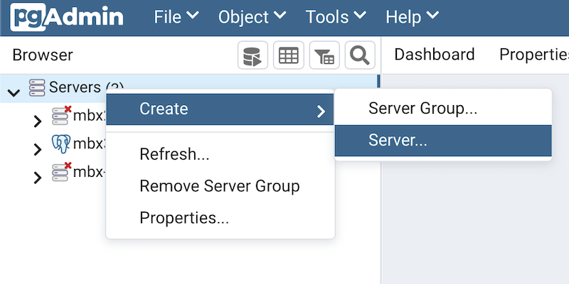

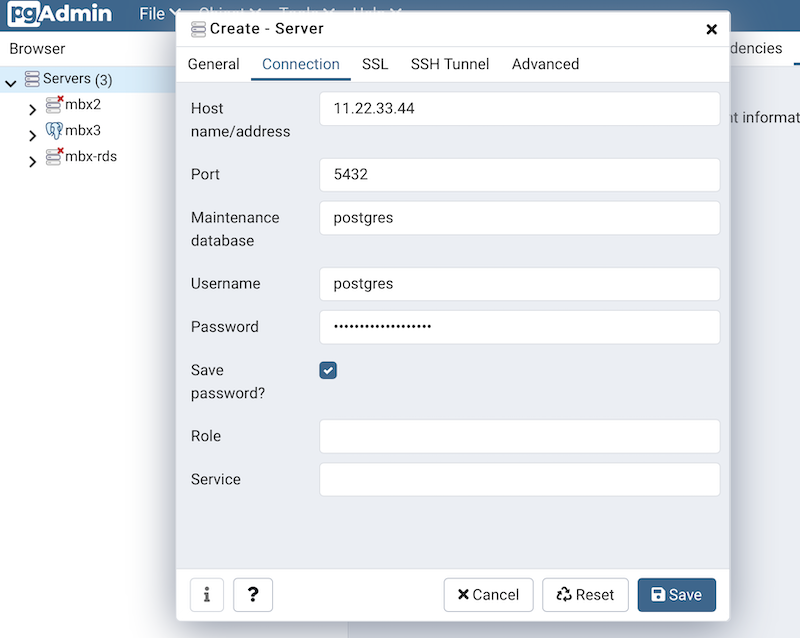


## Load Test Data Into The Source Postgres DB

You can find detailed information about PostgreSQL sample datasets on this wiki page: https://wiki.postgresql.org/wiki/Sample_Databases. 

In this guide, I have downloaded the monthly csv file instead of the full dataset. https://www.gov.uk/government/statistical-data-sets/price-paid-data-downloads#current-month-august-2020-data. First, let's create the project database. 

From the EC2 Postgres server, log into the `psql` command line utility:

```bash
sudo -u postgres psql template1
```

From the `psql` command line, list key databases:

```sql
\l
```

Create the test database to be migrated. I am assigning the name `mbxDB` to my database but you can assign a different name. 

```sql
create database mbxDB;
```

Make `mbxDB` active:

```sql
\c mbxDB
```

Create the table structure for `land_registry_price_paid_uk`:

```sql
CREATE TABLE land_registry_price_paid_uk(
  transaction uuid,
  price numeric,
  transfer_date date,
  postcode text,
  property_type char(1),
  newly_built boolean,
  duration char(1),
  paon text,
  saon text,
  street text,
  locality text,
  city text,
  district text,
  county text,
  ppd_category_type char(1),
  record_status char(1)
);
```

Quit `psql`:

```sql
\q
```

You will now return to the OS command line.

## Import land_registry_price_paid_uk CSV Data

I will use pgAdmin for the data import task because of the simplicity of the workflow. The `psql` command line tool can do the trick too via the `\copy` command. 

1.  Find the `mbxDB` and expand it in the Object Browser.
2.  Find and select the `land_registry_price_paid_uk` table. 
3.  Right-click on the table `land_registry_price_paid_uk`.
4.  Select **Import/Export Data** from the menu.
5.  In the dialog box, select **Import** from the Export/Import slider.
6.  Select the CSV file that you downloaded earlier from your local drive. 
7.  Click **OK** and wait for a successful import message.
8.  Verify data is uploaded using pgAdmin by querying data rows from the `land_registry_price_paid_uk` table.

## Provision The Database Migration Service

In this section, I will configure the DMS resources that will kick-off the database migration. The steps involved are as follows:

*   Create a Replication Instance
*   Create and test the source DB endpoint
*   Create and test the target DB endpoint
*   Create the Migration Task
*   Validate/iterate until all required data is migrated from the EC2-hosted Postgres to the RDS Postgres.

### Create Replication Instance

1.  From the AWS Management Console, open the Database Migration Service dashboard.
2.  From the left navigation pane, select **Replication instances**.
3.  Click on **Create replication instance**.
4.  Fill out the wizard forms:
    *   Assign a name to the replication instance. 
    *   Instance class: `dms.t2.medium` (or equivalent suitable for testing)
    *   Engine version: *Select latest stable version* (e.g. 3.4.x)
    *   Allocated storage (GiB): `50` (default)
  
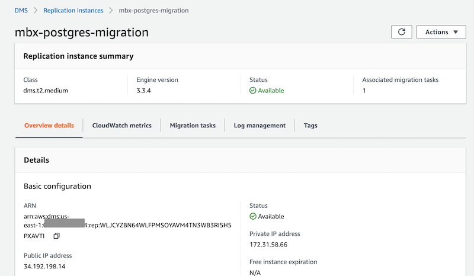

5.  VPC: Default
6.  Multi-AZ: uncheck/deselect
7.  Publicly accessible: check/select
8.  Advanced security and network configuration: accept defaults

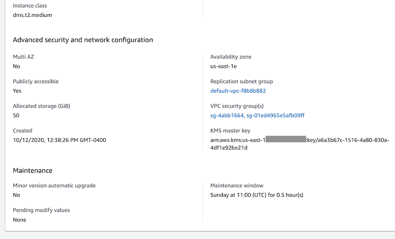

9.  Maintenance: accept defaults
10. Click on **Create**.
11. Wait for the Status to change to **Available**.

### Create And Test The Source EC2 DB Endpoint

1.  From the Database Migration Service dashboard, select **Endpoints** from the left panel.
2.  Select **Create endpoint**.
3.  Select **Source endpoint**.
4.  Fill out the wizard forms:
    *   Assign a name to the Endpoint identifier. Ex: `mbx-postgres-ec2-source`
    *   From the Source engine dropdown menu, select `PostgreSQL`.
    *   For Server name, provide the public IP address for the EC2 Postgres instance. 
    *   Port: `5432`
    *   User name: `postgres`
    *   Password: enter the password that you specified earlier.
    *   Database name: `mbxDB`
5.  Expand the **Test endpoint connection** section. 
    *   Select the default VPC.
    *   Select the replication instance name you have created.
    *   Select **Run test**.
6.  Wait for the test status to show **successful**.
7.  If not, troubleshoot the cause (e.g., Security Group rules blocking port 5432) before you proceed to the next step.

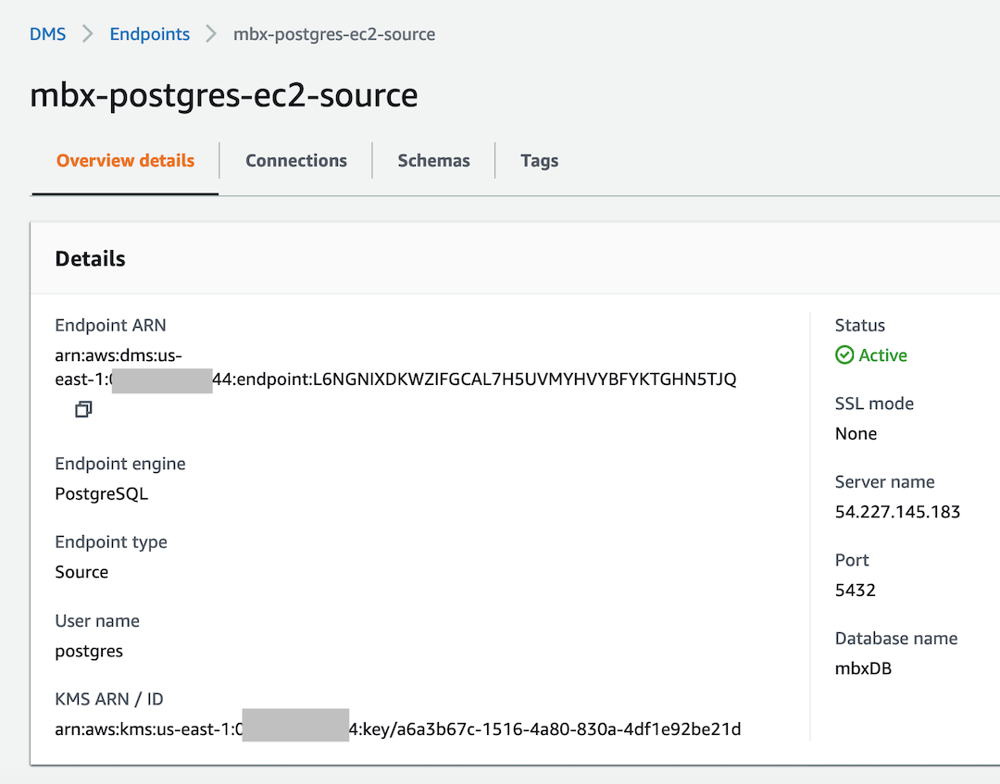

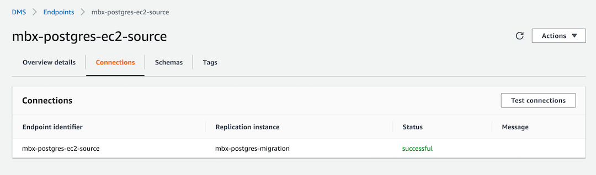


### Create And Test The Target DB RDS Endpoint

1.  From the Database Migration Service dashboard, select **Endpoints** from the left panel.
2.  Select **Create endpoint**.
3.  Select **Target endpoint**. 
4.  Assign a name to the Endpoint identifier. Ex: `mbx-target-postgres-rds`
5.  Check **Select RDS DB instance**.
6.  From the dropdown menu, select the RDS Postgres DB you have created earlier.
7.  The remaining fields will be filled out automatically based on your RDS database selection, except the password which you will need to provide.
8.  Expand the **Test endpoint connection** section. 
    *   Select the default VPC.
    *   Select the replication instance name you have created.
    *   Select **Run test**.
9.  Wait for the test status to show **successful**.
10. If not, troubleshoot the cause before you proceed to the next step.

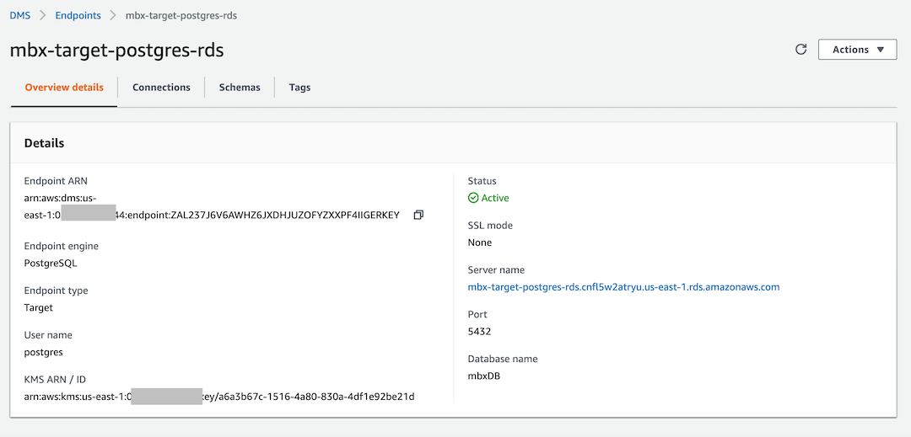

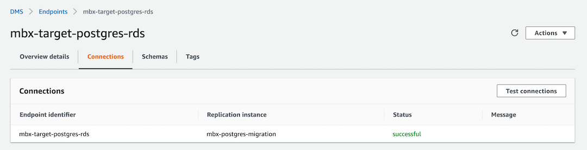

Once you have successful endpoint tests, proceed to create the migration task.

### Create The Database Migration Task

1.  From the Database Migration Service dashboard, select **Database migration tasks**.
2.  Select **Create task**.
3.  Enter a name for Task identifier. Ex: `mbx-postgres-migration-task`
4.  From the Replication instance dropdown menu, select the replication instance you have created earlier.
5.  From the Source database endpoint dropdown, select the source EC2 endpoint.
6.  From the Target database endpoint dropdown, select the target RDS endpoint.
7.  From Migration type, select **Migrate existing data**.
8.  In the Task settings panel > Editing mode, select **Wizard**.
9.  Select **Drop tables on target** (default).
10. Select **Limited LOB mode** (default).
11. For Maximum LOB size (KB), keep the `32` value. 
12. Check **Enable CloudWatch logs**.
13. In the Table mappings panel > Editing mode, select **Wizard**.
14. Expand **Selection rules**.
    *   For Schema name, enter `%`
    *   For Table name, enter `%`
15. Select **Create task**.

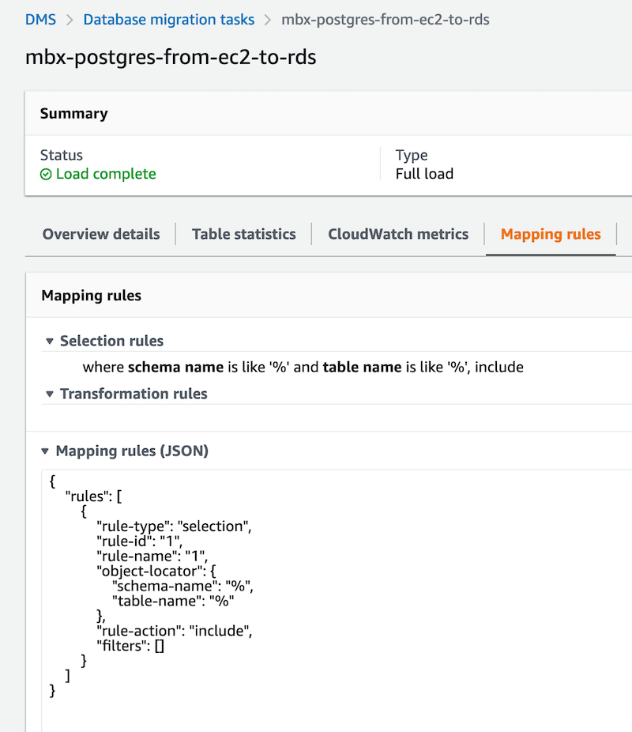

16. If the Task did not start automatically, select it, click on the **Actions** dropdown menu, and select **Restart/Resume**.
17. In the Summary panel, wait for the status to show **Load complete**.

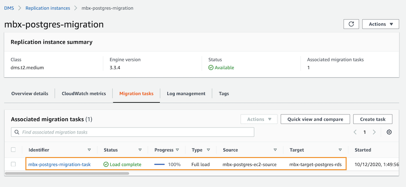

18. From the Table statistics panel, scroll to verify that you have `67,788` rows loaded (or the number of rows matching your dataset).

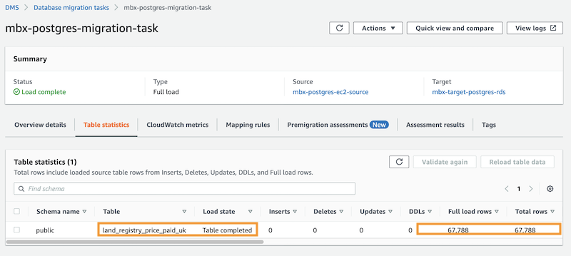

19. Using pgAdmin, connect to your RDS Target DB and verify that the data has successfully migrated there. This video clip will show the final results of migrated data in RDS: https://youtu.be/QHKhyzPUPaU

## Resourcing Database Migration Efforts

If you are working in a production environment, it's vital that an expert Postgres DBA is involved to help resolve Postgres-specific technical issues such as authentication and validation. And since database migration projects typically involve migrating business data, having a domain subject matter expert is equally important to help answer data-specific questions such as:
*   Which data to migrate?
*   What data transformations are needed?
*   What SLAs are needed to meet the business objectives?
*   What are the database migration acceptance tests that need to be applied at the end of the migration process?

## Summary
By completing this guide, you have successfully set up an end-to-end database migration workflow using AWS Database Migration Service (DMS). We demonstrated how to build a robust replication instance, connect to both a simulated on-premises database via Amazon EC2 and a fully managed Amazon RDS cluster, and move our test dataset securely. Embracing AWS DMS for these operational needs reduces latency constraints, enables seamless data transition, and leverages the power of cloud-native analytics and scaling for your database workloads. 

## References
*   [AWS Database Migration Service (DMS)](https://aws.amazon.com/dms/)
*   [Install Postgres on Ubuntu](https://ubuntu.com/server/docs/databases-postgresql)
*   [Postgres downloads](https://www.postgresql.org/download/linux/ubuntu/)
*   [Deploy an Amazon RDS Postgres database](https://aws.amazon.com/getting-started/tutorials/create-connect-postgresql-db/)
*   [pgAdmin Postgres Tools](https://www.pgadmin.org/)

Thank you for reading!
